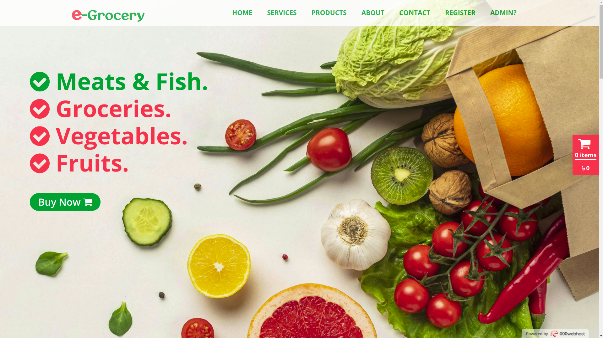

# e-shop

E-grocery is mainly an online grocery store

 

# How It Looks Like
### **[Click to Explore Live! ](http://e-grocery10.000webhostapp.com/)**

 

 

# How to run

* ### [Click to download the zip file! ](https://github.com/saiful-70/e-grocery/archive/refs/heads/main.zip)(file size is about 30mb)

* Extract the zip file
* Rename the extracted folder to __'e-grocery'__
* Move the folder to __'htdocs'__
* Start __'apache'__ and __'mysql'__ server
* Create a database named __'e-grocery'__
* Here import database from __'/data/e-grocery.sql'__
* Now your project is ready
* Go to __https://localhost/e-grocery__ and see the output
* For database management go to __https://localhost/e-grocery/admin__ and take some __CRUD__ operation.

# Tools used
* __BOOTSTRAP__ for layout and some tools
* __MYSQL__ for database
* __PHP__ as backend language